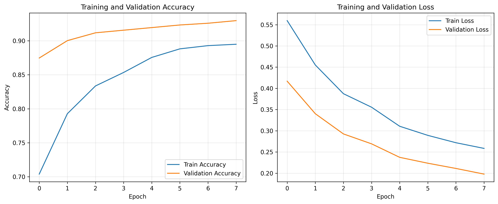
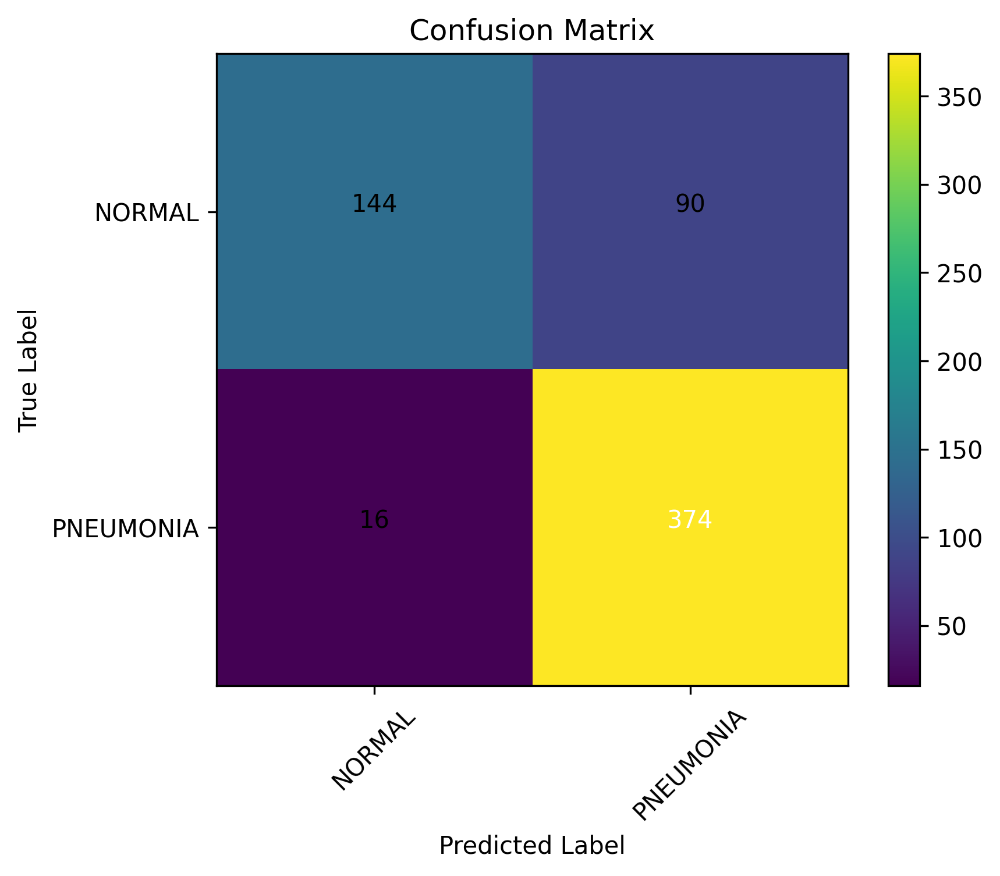
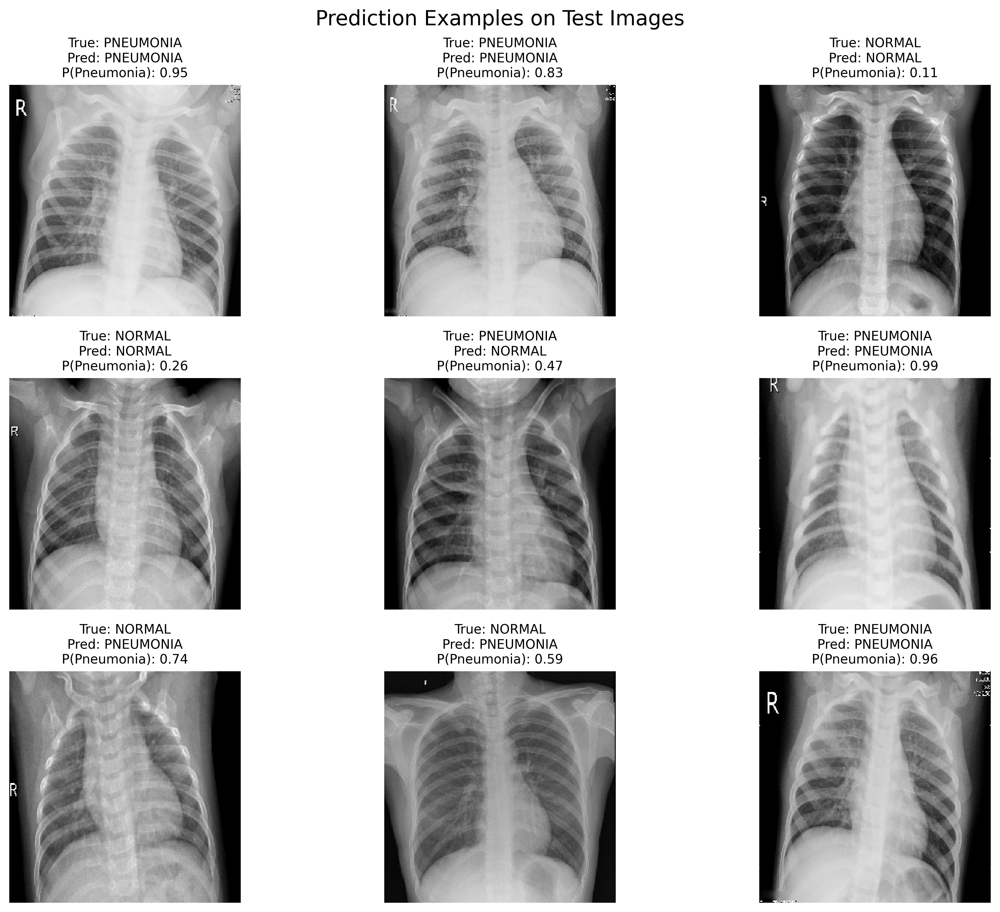

# Chest X-Ray Pneumonia Classification

This project uses deep learning to classify chest X-ray images into two categories: **NORMAL** and **PNEUMONIA**.

The goal of this project is to build a simple and complete medical image classification pipeline using transfer learning. The project is implemented in a Google Colab notebook, where the dataset is downloaded, preprocessed, trained, evaluated, and visualized.

## Project Overview

Pneumonia is a lung infection that can often be identified from chest X-ray images. In this project, a convolutional neural network model based on transfer learning is used to detect pneumonia from chest X-ray images.

Compared to semantic segmentation tasks, this project is simpler because the model predicts one label for the entire image instead of predicting a class for each pixel.

## Dataset

The project uses the **Chest X-Ray Images Pneumonia** dataset from Kaggle.

The dataset contains chest X-ray images organized into two classes:

- NORMAL
- PNEUMONIA

The original dataset structure is:

```text
chest_xray/
├── train/
│   ├── NORMAL/
│   └── PNEUMONIA/
├── val/
│   ├── NORMAL/
│   └── PNEUMONIA/
└── test/
    ├── NORMAL/
    └── PNEUMONIA/
```

In this project, the original training set is split into training and validation subsets. The original test set is used only for final evaluation.

## Methodology

The main steps of the project are:

1. Download the dataset directly inside Google Colab.
2. Explore the dataset and visualize sample images.
3. Resize all images to 224x224.
4. Create training, validation, and test datasets.
5. Apply simple data augmentation.
6. Train a transfer learning model using MobileNetV2.
7. Evaluate the model using classification metrics.
8. Visualize the training process, confusion matrix, and prediction examples.

## Model Architecture

The model is based on **MobileNetV2** pretrained on ImageNet.

The architecture is:

```text
Input Chest X-Ray Image
↓
Data Augmentation
↓
MobileNetV2 Backbone
↓
Global Average Pooling
↓
Dropout
↓
Dense Layer with Sigmoid Activation
```

Since this is a binary classification task, the model outputs one probability value:

```text
0 → NORMAL
1 → PNEUMONIA
```

## Training

The model was trained using the following setup:

- Image size: 224x224
- Batch size: 32
- Loss function: Binary Cross-Entropy
- Optimizer: Adam
- Transfer learning backbone: MobileNetV2
- Metrics: Accuracy, Precision, Recall, and AUC

Class weights were used because the dataset is imbalanced and contains more pneumonia images than normal images.

## Training Curves

The following plot shows the training and validation accuracy/loss during training.



## Evaluation

The model was evaluated on the test set using common binary classification metrics:

- Accuracy
- Precision
- Recall
- F1-score
- Confusion Matrix

## Confusion Matrix

The confusion matrix shows how many images were correctly and incorrectly classified for each class.



## Prediction Examples

The following examples show test images with their true labels, predicted labels, and pneumonia prediction probabilities.



## Project Structure

```text
Chest-XRay-Pneumonia-Classification/
├── notebooks/
│   └── Chest_XRay_Pneumonia_Classification.ipynb
├── assets/
│   ├── training_curves.png
│   ├── confusion_matrix.png
│   └── prediction_examples.png
├── .gitignore
├── requirements.txt
└── README.md
```

## How to Run

1. Clone this repository:

```bash
git clone https://github.com/DenizPasoudeh/Chest-XRay-Pneumonia-Classification.git
```

2. Open the notebook:

```text
notebooks/Chest_XRay_Pneumonia_Classification.ipynb
```

3. Run the notebook in Google Colab.

The dataset will be downloaded automatically inside the notebook.

## Requirements

The main libraries used in this project are:

- TensorFlow
- NumPy
- Pandas
- Matplotlib
- Scikit-learn
- KaggleHub

Install the dependencies with:

```bash
pip install -r requirements.txt
```

## Disclaimer

This project is for educational purposes only and should not be used as a medical diagnosis system.
